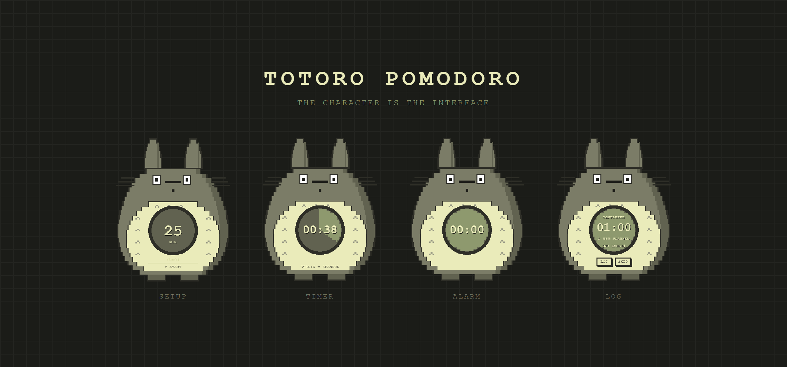
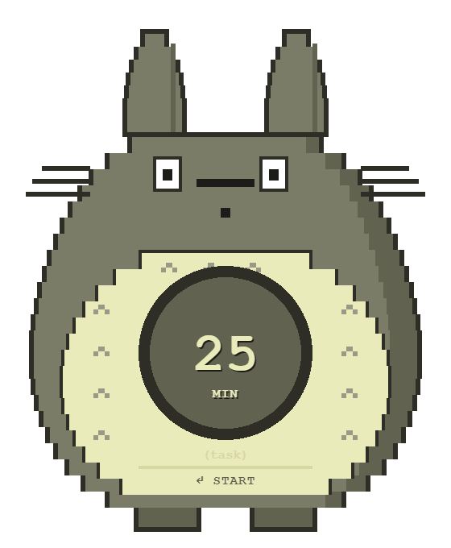
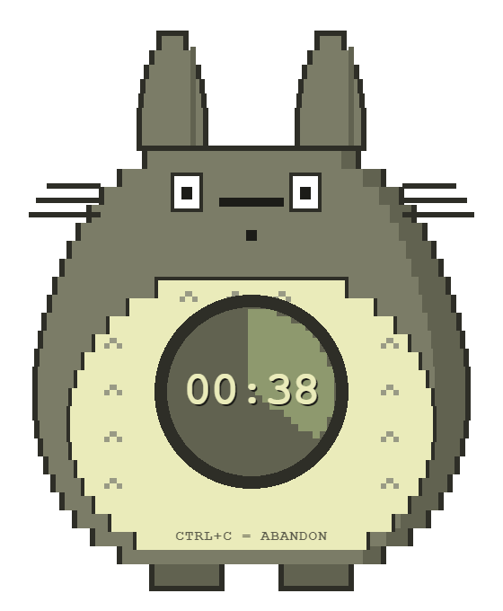
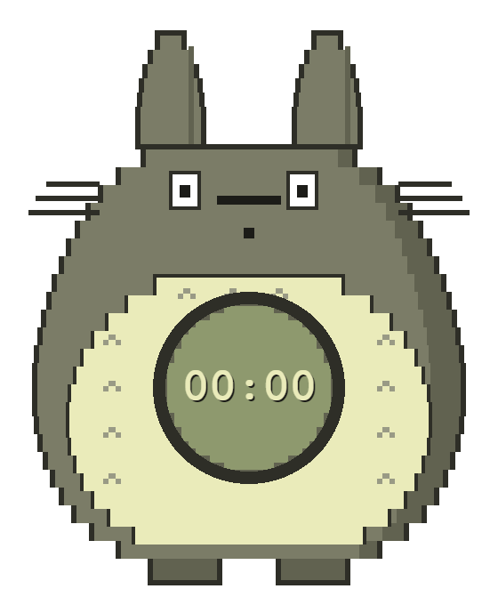
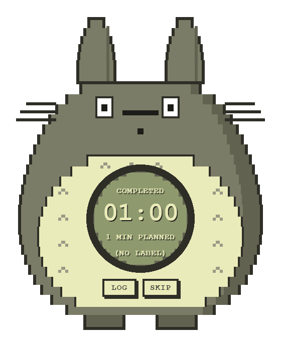

<div align="center">



# Totoro Pomodoro

**A pixel-art Totoro who sits quietly on your desktop and keeps your Pomodoro time in his belly.**

No title bar. No dashboard. No panels. The character *is* the interface.

[](https://www.electronjs.org/)
[](https://www.typescriptlang.org/)
[](tests)
[](#packaging)
[](LICENSE)

</div>

---

## What it is

A frameless, transparent, always-on-top desktop companion. You type a duration
into Totoro's belly, press Enter, and a green wedge fills his stomach clockwise
as time passes. When it's done he flashes, beeps and shakes until you deal with
him. Then he asks whether to write the session to your Markdown log.

Every pixel is drawn from axis-aligned SVG rectangles on integer coordinates —
no images, no gradients, no blur, no anti-aliased artwork. A restrained
eight-colour palette, hard edges, and stepped contours throughout.

<div align="center">

| Setup | Timer | Alarm | Log |
|:---:|:---:|:---:|:---:|
|  |  |  |  |
| Type minutes and an optional task | The wedge grows in 60 discrete steps | Flash, beep and shake | Write it down, or skip |

</div>

---

## Install

```bash
git clone https://github.com/NekoTensor/totoro-pomodoro.git
cd totoro-pomodoro
npm install
```

Run it:

```bash
npm run dev
```

Build a desktop app:

```bash
npm run build:win
```

The installer and a portable `.exe` land in `release/`. `build:mac` and
`build:linux` produce a dmg and an AppImage/deb, each on its own platform.
Builds are unsigned, so SmartScreen and Gatekeeper will warn on first launch.

> **Autostart** — drop a shortcut into `shell:startup` (Windows), Login Items
> (macOS), or your desktop's autostart folder to have Totoro appear with your
> session.

---

## Using it

| Where | Key | Action |
|:--|:--|:--|
| Setup | `Enter` | Start the session |
| Timer | `Ctrl+C` / `Cmd+C` | Abandon |
| Alarm | `Enter` *or any click* | Dismiss |
| Log prompt | `Enter` | Write the entry |
| Log prompt | `Esc` | Skip without logging |
| Log failed | `N` | Choose a new destination |

Durations run from 1 to 180 minutes; tasks are capped at 24 characters. The
wedge shows **elapsed** time, not remaining — an empty belly means you've just
started, a full one means you're done.

Drag Totoro anywhere by his body; the inputs and buttons stay clickable, and
his position is remembered. Hover to reveal a gear and a close button. A tray
icon offers the same options plus *Open log file* and *Recenter Totoro*.

---

## Your sessions, in Markdown

By default `pomodoro-log.md` in your Documents folder, resolved through the OS
so OneDrive and Known Folder redirection are respected — no path is ever
hardcoded. Point it at any file or folder from the gear or the tray.

```markdown
# Pomodoro Log

## 2026-08-15

- [x] 2026-08-15 14:32 — 25 min planned, 25:00 elapsed — "write spec" — completed
- [ ] 2026-08-15 15:10 — 25 min planned, 08:37 elapsed — "write spec" — abandoned
- [ ] 2026-08-15 16:00 — 25 min planned, 25:00 elapsed — interrupted
```

Entries are appended under a per-day heading and existing content is never
rewritten. Task text is stripped of control characters so nothing can inject a
list item or break the line.

**Failures never lose a session.** Every entry is written to a durable spool
*before* the log write is attempted. If the folder vanished, the drive is
unmounted or permission is denied, the belly inverts and names the reason —
`NO PERMISSION`, `PATH MISSING`, `DISK FULL` — and the queue is flushed
automatically once a working path exists.

---

## How the timer stays honest

Nothing is ever decremented. Every value is derived from the session's original
`startedAt` against the current wall clock:

```ts
elapsed   = max(0, now - startedAt)
remaining = max(0, plannedDuration - elapsed)
progress  = min(1, elapsed / plannedDuration)
```

So the countdown survives backgrounding, renderer throttling, dropped frames,
window drags, sleep and crashes. The state machine runs on a `setInterval` tick
that keeps going while the window is hidden — the animation loop is separate and
is allowed to stop, because it only animates.

Quit mid-session and it resumes from where it genuinely is, never from zero. If
the planned end passed while the app was closed or the machine slept for more
than two minutes, the session is reported as `interrupted` rather than firing an
alarm about something that finished hours ago.

---

## Architecture

```
src/
├── shared/     types, validation, Markdown formatting   ← pure, no Electron/DOM
├── main/       lifecycle, window, tray, IPC, persistence, log writer
├── preload/    the narrow contextBridge API
└── renderer/   character SVG, dial, state machine, timer engine, UI
```

The state machine is a pure reducer and the timer engine is pure timestamp
arithmetic — neither imports Electron or the DOM, which is what makes them
directly unit-testable.

```
SETUP ──START──▶ TIMER ──ELAPSED──▶ ALARM ──DISMISS──▶ LOG_PROMPT ──▶ SETUP
                   │                                        ▲
                   └──────────────  CANCEL  ────────────────┘
```

Each phase registers its side effects and returns a disposer, so no interval,
audio node or animation loop can leak across a transition.

### Security

`contextIsolation: true`, `nodeIntegration: false`, `sandbox: true`, a strict
CSP, navigation and window-open denied, and all permission requests refused.

The preload exposes eleven specific functions — no `fs`, no `path`, no
`require`, no generic `ipcRenderer`. **The renderer can never supply a
filesystem path**: it sends only `{ outcome, plannedMinutes, elapsedMs, task,
endedAt }`, and the main process resolves the destination from its own
persisted state and formats the Markdown itself. `shakeWindow()` takes no
arguments so a compromised renderer cannot move the window. Every IPC payload
is re-validated in main.

---

## Development

```bash
npm test          # Vitest: 87 tests
npm run typecheck # main + renderer
```

Tests cover the timestamp arithmetic under mocked clocks and multi-hour sleep
gaps, every state transition including the illegal ones, payload validation,
byte-exact Markdown output, the log writer and spool against a temp directory,
and crash recovery.

Two helper scripts render the real UI so the docs and the pixel art can be
reviewed without squinting at a 280×340 window:

```bash
npx electron scripts/shot.cjs             # a full session to shots/
npx electron scripts/gen-docs-images.cjs  # README artwork to docs/
```

The palette lives in one place, [`src/renderer/components/palette.ts`](src/renderer/components/palette.ts),
mirrored by the CSS variables and the icon generator.

| | |
|:--|:--|
| Body | `#7C7C64` |
| Body shadow | `#62624E` |
| Outline | `#2E2E26` |
| Dark details | `#1C1C18` |
| Belly | `#EBEBB4` |
| Belly shadow | `#D8D89A` |
| Timer green | `#8B9A68` |
| Timer highlight | `#B4C38A` |

---

## Notes

**Linux** — window transparency requires a running compositor; without one the
window may render with an opaque background.

**Attribution** — Totoro is a character created by Hayao Miyazaki and owned by
Studio Ghibli. This is an unofficial, non-commercial fan project with no
affiliation to or endorsement by Studio Ghibli. The pixel art here is an
original interpretation drawn in code, not traced or copied from any Ghibli
asset.

**License** — [MIT](LICENSE), for the code.

<div align="center">
<sub>Built with a spec, an interview, and 81 tests.</sub>
</div>
