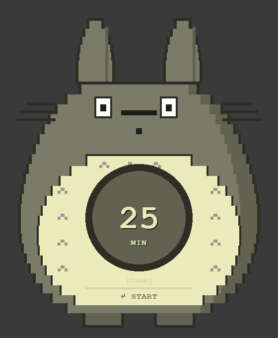

# Totoro Pomodoro

A pixel-art Totoro who sits quietly on your desktop and keeps your Pomodoro
time in his belly. The character *is* the UI — there is no title bar, no panel,
no dashboard. Sessions are appended to a Markdown file you choose.



The full specification, including every decision behind the design, is in
[SPEC.md](SPEC.md).

## Getting it running

```bash
npm install
```

Run it from source:

```bash
npm run dev
```

Or build and run the production bundle:

```bash
npm start
```

Build a Windows installer plus a portable `.exe` into `release/`:

```bash
npm run build:win
```

`npm run build:mac` and `npm run build:linux` produce a dmg and an
AppImage/deb, but each must be run on its own platform. Builds are unsigned, so
Windows SmartScreen and macOS Gatekeeper will warn on first launch.

## Using it

| Where | Key | What it does |
| --- | --- | --- |
| Setup | `Enter` | Start the session |
| Timer | `Ctrl+C` / `Cmd+C` | Abandon the session |
| Alarm | `Enter` or any click | Dismiss |
| Log prompt | `Enter` | Write the entry to your log |
| Log prompt | `Esc` | Skip without logging |
| Log failed | `N` | Choose a new log destination |

Type a duration (1–180), optionally a task of up to 24 characters, and press
Enter. The green wedge in the dial grows clockwise from 12 o'clock as time
*elapses*, so an empty dial means you have just started and a full one means
you are done.

Drag Totoro anywhere by his body — the inputs and buttons stay clickable. His
position is remembered. Hover to reveal a gear (change log destination) and a
close button in the top-right corner. There is also a tray icon with the same
options plus *Open log file* and *Recenter Totoro*.

## Where your sessions go

By default `pomodoro-log.md` in your Documents folder, resolved through the
OS so OneDrive/Known Folder redirection is respected. Change it any time via
the gear or the tray; you can pick a Markdown file or a folder (a folder gets a
`pomodoro-log.md` inside it).

Entries are appended under a `## YYYY-MM-DD` heading per day, and existing
content is never rewritten:

```markdown
# Pomodoro Log

## 2026-08-15

- [x] 2026-08-15 14:32 — 25 min planned, 25:00 elapsed — "write spec" — completed
- [ ] 2026-08-15 15:10 — 25 min planned, 08:37 elapsed — "write spec" — abandoned
- [ ] 2026-08-15 16:00 — 25 min planned, 25:00 elapsed — interrupted
```

If a write fails — folder deleted, drive unmounted, permission denied — the
entry is already queued in a spool file, the belly shows an error, and the
queue is flushed automatically once a working path exists. A session is never
silently lost.

## How the timer stays honest

Nothing is ever decremented. Every reading is derived from the session's
original `startedAt` against the current wall clock:

```
elapsed   = max(0, now - startedAt)
remaining = max(0, plannedDuration - elapsed)
progress  = min(1, elapsed / plannedDuration)
```

So the countdown survives backgrounding, dropped frames, renderer throttling,
window drags, sleep and crashes. Quit mid-session and it resumes where it
really is, not from zero. If the planned end passed while the app was closed or
the machine was asleep for more than two minutes, the session is reported as
`interrupted` rather than firing an alarm about something that ended hours ago.

## Development

```bash
npm test          # Vitest suite
npm run typecheck # main + renderer
```

`npx electron scripts/shot.cjs` renders the real UI to `shots/*.png` — useful
for reviewing the pixel art without squinting at a 280×340 window.

### Layout

```
src/
  shared/     types, validation, Markdown formatting  (pure, no Electron/DOM)
  main/       lifecycle, window, tray, IPC, persistence, log writer
  preload/    the narrow contextBridge API
  renderer/   character SVG, dial, state machine, timer engine, UI
```

The timer engine (`src/renderer/services/timer.ts`) and everything in
`src/shared/` import nothing from Electron or the DOM, which is what makes them
directly unit-testable.

### Security

`contextIsolation: true`, `nodeIntegration: false`, `sandbox: true`, a strict
CSP, navigation and window-open denied, and all permission requests refused.
The preload exposes eleven specific functions and nothing else — no `fs`, no
`path`, no `require`, no generic `ipcRenderer`.

The renderer can never supply a filesystem path. It sends only
`{ outcome, plannedMinutes, elapsedMs, task, endedAt }`; the main process
resolves the destination from its own persisted state and formats the Markdown
itself. `shakeWindow()` takes no arguments so a compromised renderer cannot
drive the window around the screen. Every IPC payload is re-validated in main.

## Linux note

Transparency requires a running compositor. Without one the window may appear
with an opaque background.
